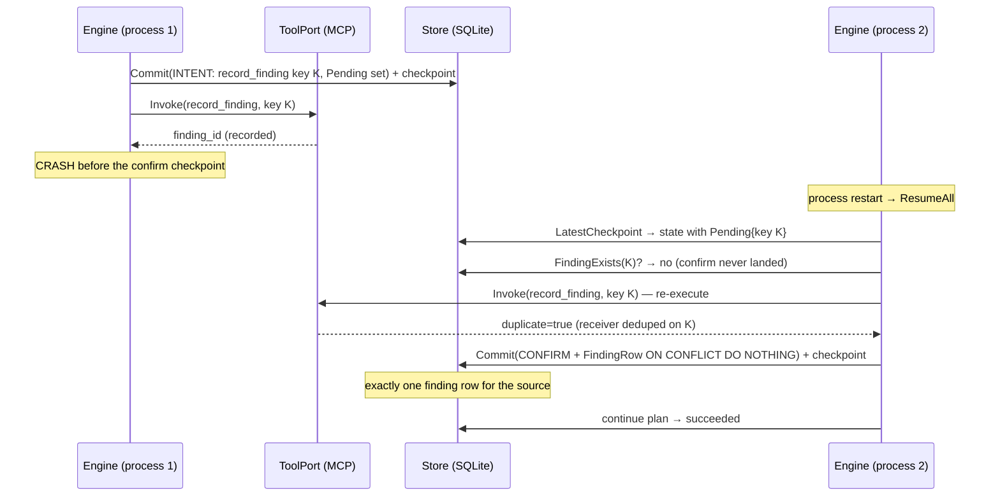

# Sequence: crash and resume (exactly-once)

A process killed after a side effect executes but before its confirm checkpoint
resumes without duplicating the effect.

Correctness rests on three invariants:

1. the checkpoint and the `runs.version` are written in one transaction, so the
   latest checkpoint is always consistent;
2. the planner and the idempotency key are deterministic, so re-planning after a
   restart reproduces the identical step and key; and
3. the `side_effects` ledger plus the `UNIQUE(idempotency_key)` constraint make
   re-execution a no-op.
