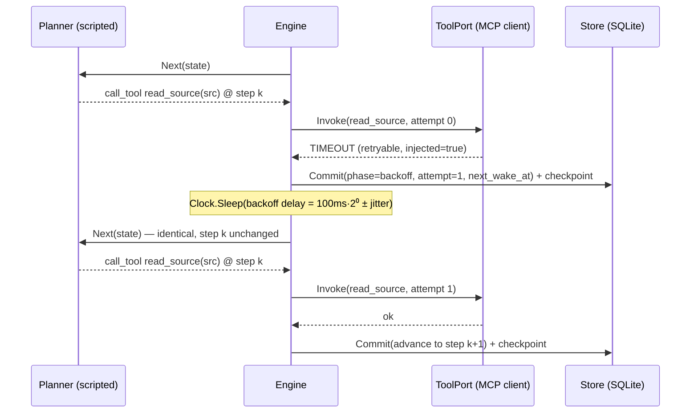

# Sequence: retry with bounded backoff

A retryable tool failure (e.g. a timeout) is retried with the same idempotency
key after a deterministic backoff, bounded by the retry budget. Each durable
transition is checkpointed.

If the budget is exhausted before a retry wins, the run commits a terminal
`failed` with code `RETRIES_EXHAUSTED`, and all findings recorded before the
failing step remain inspectable.
