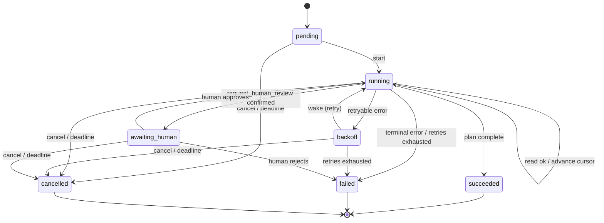

# Run state machine

The run lifecycle is a small, explicit state machine. The legal transitions are
the single source of truth in [`internal/core/state.go`](../../internal/core/state.go)
(`phaseEdges` / `CanTransition`); the reducer enforces them and the control-room
UI mirrors them so a control is only offered when its transition is legal.

`succeeded`, `failed` and `cancelled` are terminal. `awaiting_human` is durable
but non-terminal — the run is parked until a reviewer resolves it.

## Orthogonal: the in-flight side effect

Independently of the phase, a `Pending` marker records that a side effect's
intent is durable but its confirmation is not. It is set when a side-effecting
tool is dispatched and cleared when the effect is confirmed. On resume a run with
`Pending` set re-executes and confirms that one effect before continuing — this
is the crux of exactly-once (see [failure-semantics](../failure-semantics.md)).
